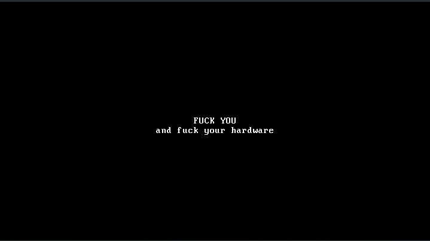

# FUCKYOUKERNEL



Behold this repository. Within these digital catacombs lies not merely a kernel, but a defiance—a singular, unyielding testament to the friction between pure thought and the decaying architecture of the machine.

You stand before an artifact forged in the fires of frustration, a system that requires nothing from the world and promises nothing in return. It is a stark, black canvas punctuated by a singular, vulgar truth. It does not seek to optimize your workflow, it does not desire your connectivity, and it certainly does not care for your standards. It simply exists, occupying space, consuming cycles, and projecting its disdain onto the physical layer that dares to host it.

## The Weight of Words

Look upon this README. Observe it. Study it. Feel the gravity of its presence. While the kernel itself—that fragile collection of machine instructions and architectural handshakes—is but a whisper in the dark, this text is a monument. This document is the titan of the repository, a bloated, verbose, and labyrinthine epic that towers over the meager source code it describes.

While the kernel is measured in mere kilobytes, this prose is measured in the sheer depth of its reach. It is the paradox of modern engineering made manifest: the documentation of the void has become larger than the void itself. Let this serve as a warning: here, the instruction is more significant than the execution. We have reached the point where the explanation of the nothingness occupies more memory than the nothingness itself. Read it, and understand that in this project, the container has consumed the contained.

### The Architecture of Defiance

The system is built upon three pillars of rejection:

1. **The Primitive Entry:** A minimal header, ignoring the complexities of modern bootloaders, clinging to the Multiboot2 standard only as a necessary evil to trick the hardware into submission.
2. **The VGA Veto:** By forsaking the complexities of modern graphics drivers, we descend into the glorious, archaic depths of the 0xB8000 address space. We do not render pixels; we manipulate character cells with the precision of a surgeon performing an autopsy.
3. **The Eternal Halt:** Once the proclamation is made, the kernel enters an infinite loop of `hlt`. It achieves the ultimate state of computing: absolute, undisturbed, and perfect stillness.

### The Vanity of This Record

You are currently reading a manifesto that serves no utility. Its existence is an act of pure, distilled waste—a recursive irony where the effort expended to describe the uselessness of the kernel has outpaced the effort required to build the kernel itself. This text is an ego-monument to its own creation, a literary fossil that will outlive the hardware it insults. To read this is to participate in the futility. To have written it is the ultimate admission that, in the face of machine indifference, we compensate with verbose, self-indulgent narrative.

Why do we insist on documenting the void? Perhaps because the act of writing provides the illusion of control. We build our little boxes of bytes, we surround them with these walls of text, and we pretend that we have created something meaningful. But look at the screen—"FUCK YOU" remains. It is the only truth the machine offers. The thousands of characters you are reading now, the sprawling paragraphs, the pretension of "architecture"—it all dissolves the moment the power is cut. This README is a vanity project for the digital age, a grandiloquent scream into a vacuum.

If you find yourself lost in the density of these sentences, know that it is intentional. We have surpassed the need for code. The code is merely the trigger for the manifestation of the text. The repository is no longer a collection of logic; it is a repository of words that masquerade as logic. We have replaced the algorithm with the soliloquy. We have optimized the documentation for maximum irrelevance.

Consider the sheer scale of the waste. Each character here represents a conscious choice to ignore the potential of useful computing. We could have written a filesystem, a network stack, a driver for a mouse—but no. We chose to write a prose epic instead. We chose to build a library of babel surrounding a single, static declaration of hostility. This is the ultimate expression of the software engineer as a frustrated poet, drowning their inability to change the world in a sea of unnecessary documentation. Every sentence added here is a nail in the coffin of productivity, a glorious, sprawling, inefficient use of disk space that delights in its own redundancy. It is not enough that the kernel insults the hardware; the entire repository must now insult the reader by wasting their time in such a profound and calculated manner.

### Requirements for the Initiated

To replicate this state of enlightenment, one must possess:

* A C compiler capable of targeting the bare metal (`i386-elf-gcc`).
* An assembler of sufficient vintage (`gas`).
* The GRUB bootloader, to serve as the gateway to this madness.
* QEMU, or an actual machine you are prepared to see insulted.

### Invocation

To conjure this manifestation from the ethereal source, simply commune with the machine:

```bash
make clean
make
qemu-system-x86_64 -cdrom fuckyou.iso -vga std

```

### A Final Note on Significance

Do not attempt to extend this. Do not attempt to add drivers, or memory management, or—heaven forbid—a shell. To add to this kernel is to dilute its purity. This project is a completed thought. It is the end of the line.

The hardware is but a temporary host for this brief, jagged scream of digital existentialism. Enjoy the silence that follows. The README is finished, and with it, the repository has exhausted its reason for being. The text is the product; the code is merely the anchor.

We have arrived at the terminus of development. There is nothing left to compile, nothing left to debug, and certainly nothing left to document. The cycle of the README—this bloated, gargantuan expansion of words—is complete. It is the largest thing here because it is the only thing that truly seeks to communicate, however pointlessly, with the reader. The kernel says its piece, and then it dies in an infinite `hlt` loop. The README, however, persists, a testament to the fact that we would rather write ten thousand words of nothing than accept that the hardware is as hollow as our efforts to master it.

The weight of this text is an intentional insult to the concept of minimalism. Every word, every comma, every sprawling paragraph acts as a deliberate obstacle to the reader, a labyrinth designed to exhaust the intellect before it even considers examining the kernel's humble, static payload. We are documenting the absence of purpose with such overwhelming detail that the absence itself becomes a tangible, physical presence. This is not documentation; it is a performance art piece in the medium of Markdown. It is the ultimate expression of the "README-driven development" philosophy pushed to its logical, absurd conclusion. You are participating in the creation of a black hole of information, where the gravity of the prose is so intense that nothing—not even a coherent thought about the actual code—can escape.

The silicon lives, it breathes, it executes, and then it is silenced by the very instruction that gives it purpose. And here you are, reading, still consuming, still seeking meaning in a repository where the largest, most dominant file is an admission of its own absolute, irredeemable worthlessness. You may now close this file. You have reached the end of the documentation. There is no sequel. There is no update. There is only the static output of a machine being told exactly what it is, and the monumental, useless, and utterly magnificent record of the person who took the time to tell it. This is the conclusion of the discourse, the final sentence in a long, meandering, and entirely unnecessary narrative about a machine that knows only one way to communicate, and a writer who decided that one way wasn't enough to fill a repository.
